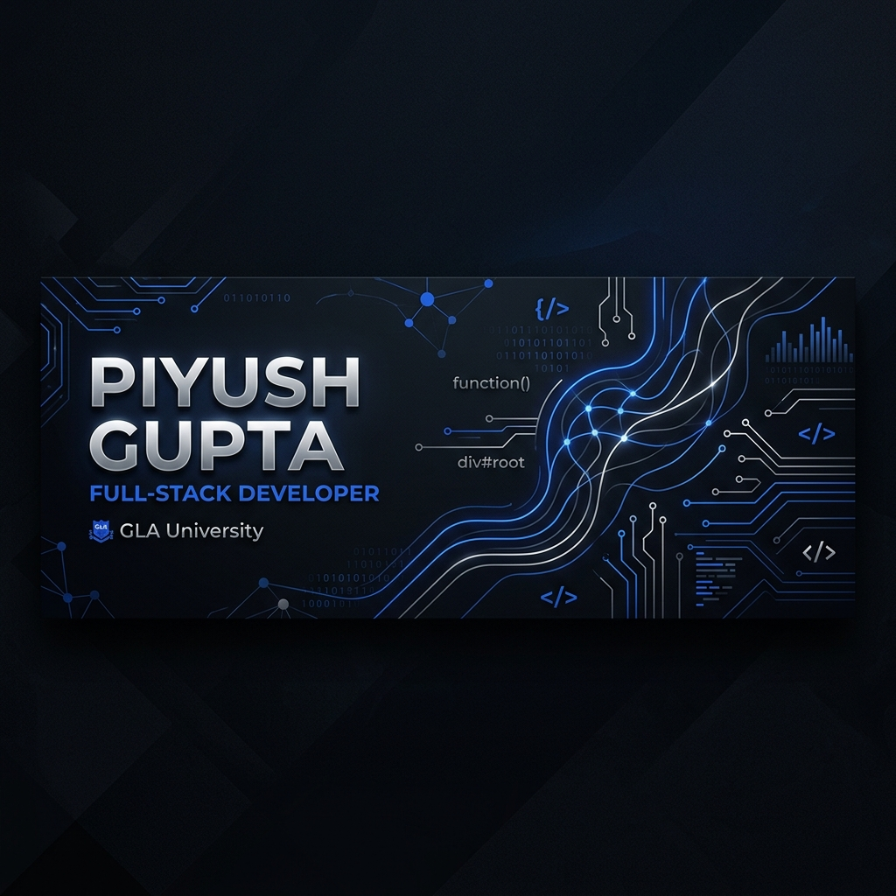

  

### Hi Devs, I’m Piyush 👋

Full Stack Developer @ GLA University | Building scalable and user-centric web applications.

> Currently focused on mastering modern frameworks and exploring performance-critical systems.

---

## 🧠 About Me

<table>
<tr>
<td width="60%" valign="top">

* 🚀 Full-stack Developer passionate about building scalable and user-centric web applications.
* 🎓 Student at GLA University, constantly exploring new technologies and frameworks.
* 🛠️ Focused on **clean code**, performance, and modern architecture.
* 🤝 Enjoy collaborating on open-source projects and solving complex engineering problems.

</td>
<td width="40%" align="center">

</td>
</tr>
</table>

---

## 🔬 Things I’ve Built

### 🔹 <a href="https://github.com/Piyush-Gupta-10/Quiz_Wiz">Quiz Wiz</a> 

An interactive quiz platform.

* Designed for engagement and seamless user experience.
* Features real-time scoring and categorization.
* Built with a focus on ease of use and modern UI.

### 🔹 <a href="https://github.com/Piyush-Gupta-10/chat_app">Chat App</a>

A real-time communication application.

* Supports instant messaging and user presence.
* Optimized for low latency and high availability.
* Features a clean, intuitive layout for easy communication.

### 🔹 <a href="https://github.com/Piyush-Gupta-10/BudgetBuddy">Budget Buddy</a>

A personal finance management tool.

* Helps users track expenses and set savings goals.
* Provides visual insights into spending habits.
* Designed with security and simplicity in mind.

---

## 📊 Engineering Metrics

  

---

## 🌐 Find Me Online

  
  &nbsp;&nbsp;&nbsp;
  

  
    GitHub · LinkedIn
  

> Interested in full-stack engineering, scalable systems, and early-stage product development.
